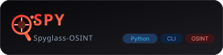

<div align="center">



# Spyglass OSINT

**One terminal for all of it** — email, username, phone, website, IP, ASN, metadata, dark web and OPSEC behind a single interface.

Nine modules behind one command. Passive by default, keyless by default, zero API keys to get started.

[](https://github.com/Ahmad170412/Spyglass-OSINT/releases)
[](https://www.python.org/)
[](LICENSE)
[](https://github.com/Ahmad170412/Spyglass-OSINT/tree/main/tests)
[](#passive-by-default)
[](https://github.com/Ahmad170412/Spyglass-OSINT)
[](https://github.com/Ahmad170412/Spyglass-OSINT/pulls)

[**Quick Start**](#quick-start) · [**What's New in 1.2.0**](#whats-new-in-120) · [**Usage**](#usage) · [**Report Bug**](https://github.com/Ahmad170412/Spyglass-OSINT/issues) · [**Security**](SECURITY.md)

</div>

---

## Why Spyglass?

- **One interface, every engine.** holehe, maigret, sherlock, subfinder, PhoneInfoga, RIPEStat, crt.sh, the Wayback Machine, Ahmia and the rest all speak the same flags and the same output format — no more fifteen terminals, fifteen syntaxes.
- **Passive by default.** Nothing probes the target. Every data point was already published or already scanned by someone else, so your name never appears in a target's access log.
- **Zero-config to first result.** The keyless path works with no API keys, no accounts and no sign-up. Optional keys unlock more; nothing is blocked behind one.
- **Honest output.** Hits are re-verified rather than trusted, CVE matches are re-checked against NVD's own ranges, and a tool that cannot answer says so instead of guessing.

---

## Table of Contents

- [What's New in 1.2.0](#whats-new-in-120)
- [Quick Start](#quick-start)
- [Architecture](#architecture)
- [Features](#features)
- [Passive by Default](#passive-by-default)
- [Installation](#installation)
- [Configuration](#configuration)
- [Usage](#usage)
- [Testing](#testing)
- [Repository Structure](#repository-structure)
- [Contributing](#contributing)
- [Security](#security)
- [License](#license)

---

## What's New in 1.2.0

The biggest release yet — Spyglass went from a script collection to a real, installable tool with a browser front end.

- **🔭 Flask web console** — every module in the browser, calling the exact functions the CLI calls. `python -m spyglass.webapp` → `127.0.0.1:5000`.
- **🌐 Three new keyless sources** — RapidDNS (passive DNS history: *what did this name resolve to, and when*), urlscan.io (passive page observations, historical `Server` headers, and who links to you), and ipwho.is (a second geolocation opinion, so one API outage no longer silently deletes the geo block).
- **🛡️ Known-vulnerability lookup** — the fingerprint phase captures *versions*, then asks NVD which published CVEs actually cover them, with the affected range printed next to every hit.
- **🧭 New `asn` module** — who routes an address, and whether the route is RPKI-protected, hijackable, or unvalidated.
- **📦 Installable distribution** — `pyproject.toml`, a real `spyglass` console script, `python -m spyglass`, and `import spyglass`. The checkout directory can be named anything.
- **🔒 Encrypted case store** — Fernet at rest with a fresh random salt per row, and a loud warning when you are writing plaintext.
- **✅ Verification overhaul** — a HTTP 200 is no longer treated as proof a profile exists; bot challenges, not-found titles and empty app shells are all rejected.
- **🧹 Passive-only** — nmap and gobuster are gone. Spyglass no longer probes the target at all.

Full detail in [CHANGELOG.md](CHANGELOG.md).

---

## Quick Start

```bash
git clone https://github.com/Ahmad170412/Spyglass-OSINT.git
cd Spyglass-OSINT
./setup.sh
spyglass --help
```

`setup.sh` installs the external tools (brew on macOS, apt on Debian/Ubuntu), creates a venv, and drops a `spyglass` launcher in `~/.local/bin`. It is idempotent — re-run it whenever.

Already in a virtualenv? From the checkout root:

```bash
pip install -e ".[all]"
spyglass email user@example.com
```

> **Spyglass ships from GitHub only — there is no PyPI package.** `pip install spyglass-osint` will fail; install from a checkout as above.

No install at all: `python -m spyglass --help` from the repo root works too.

---

## Architecture

```text
                 spyglass  —  one interface
             CLI  ·  Python API  ·  web console
                            │
    ┌───────────┬───────────┼───────────┬────────────┐
    ▼           ▼           ▼           ▼            ▼
 identity   infrastructure   files      routing      OPSEC
 email      website          metadata   asn          opsec
 username   ip
 phone      (subdomains,     (EXIF,     (prefix,
 darkweb     headers, TLS,    hashes,    origin AS,
             history, CVEs)   GPS)       RPKI)
    │           │           │           │            │
    └───────────┴─────┬─────┴───────────┴────────────┘
                      ▼
      web sources & CLI engines          opt-in case store
      crt.sh · CertSpotter · subfinder    SQLite + Fernet
      RIPEStat · InternetDB · urlscan     --store → cases
      Wayback · NVD · Ahmia · LeakCheck     diff · timeline
      Scylla · ip-api · ipwho.is · …        export
```

One code path: `webapp.py` is a transport over the same functions the CLI calls, not a second implementation. Every probe is independent and best-effort — a missing tool, a refused connection or an offline API degrades to "not present" instead of crashing the run.

---

## Features

| Module | What it checks | Engines |
|---|---|---|
| `email` | Where is this email registered? Any breaches? Any public identity? | holehe + user-scanner + blackbird + Gravatar + LeakCheck + Scylla |
| `username` | Which platforms have this profile? | user-scanner + sherlock + maigret + blackbird |
| `phone` | Who owns this number? Carrier? Region? Any footprints? | phonenumbers + PhoneInfoga + Ignorant |
| `website` | DNS, subdomains, **passive DNS history**, ports, headers, tech stack, TLS, content, WHOIS, history, **known CVEs** | dig + curl + whois + subfinder + crt.sh + CertSpotter + HackerTarget + RapidDNS + Wayback CDX + urlscan.io + InternetDB + httpx + Shodan (keyed) + NVD |
| `ip` | Where is this IP? Reverse DNS? Open ports? | ip-api.com + **ipwho.is** + dig + whois + InternetDB |
| `asn` | Who routes this address? Is the route hijackable? | RIPEStat (prefix-overview + as-overview + RPKI) |
| `metadata` | What's hidden in this file? GPS, camera, document author? | exiftool + Pillow + PyPDF2 + python-docx/openpyxl |
| `darkweb` | Search the .onion index; check breaches and breached passwords | Ahmia + Pwned Passwords + LeakCheck + Scylla (+ IntelX / HIBP optional) |
| `opsec` | Am I leaking my real IP? Is my proxy working? | dig + curl + ip-api.com + torsocks |

Beyond the module list, the things that make the results trustworthy:

- **Results are verified, not just reachable.** Username and email hits are re-fetched and checked against bot-challenge interstitials, not-found titles, empty app shells, and whether the page actually mentions the handle being searched.
- **Results are merged by agreement.** Hits are deduplicated and ranked by cross-tool agreement, labelled with the tools that matched (`Sherlock + Maigret`, `user-scanner only`) rather than raw bucket keys.
- **Subdomains are resolved before they are reported.** subfinder returns 22,250 names for `example.com`; almost all are dead certificate-log and archive entries. Resolving them first takes the same target to 1, and a canary probe suppresses the list entirely on a wildcard domain.
- **CVE matches are checked, not trusted.** NVD's `virtualMatchString` does not always apply its own version bounds — a query for nginx 1.31.3 returns CVE-2009-3555, whose range stops at 0.8.22. Every hit is re-checked against the recorded range and dropped if it does not cover the detected version. The **affected range is printed** next to every advisory, because NVD widens ranges after publication while the prose keeps its original wording.
- **RPKI is read precisely.** `valid`, `invalid` and `unknown` stay distinct and sort worst-first. "No ROA" is never called safe, and an AS-only query says why it cannot validate rather than answering "valid".

---

## Passive by Default

Spyglass does not probe the target. No port scanning, no directory brute-forcing, no vulnerability templates. Every data point is something that was **already published or already scanned by someone else** — certificate transparency logs, passive DNS, web archives, breach corpora, RIPEStat and Shodan's InternetDB.

That has one consequence worth stating plainly: **ports and services are a historical record, not a live measurement.** A closed port and a port that was open last month look identical.

Two passive probes remain, and both are opt-in by omission rather than by flag: a wordlist DNS resolve for subdomains (skipped automatically when a proxy is set, so it cannot leak your resolver) and an AXFR zone-transfer attempt.

---

## Installation

**Full setup** — external tools, venv, and the launcher:

```bash
git clone https://github.com/Ahmad170412/Spyglass-OSINT.git
cd Spyglass-OSINT
./setup.sh
```

**Into an existing virtualenv** — pick the extras you need:

```bash
pip install -e .                 # core CLI only
pip install -e ".[all]"          # engines + web console + metadata formats
pip install -e ".[tools]"        # holehe, sherlock, maigret, blackbird's peers
pip install -e ".[web]"          # the Flask console
pip install -r requirements.txt  # equivalent to ".[all]"
```

**No install:**

```bash
cd Spyglass-OSINT
python -m spyglass --help
```

The import package is `spyglass/` and the distribution is `spyglass-osint` — the checkout directory name is irrelevant, and an installed copy gives you the `spyglass` command, `python -m spyglass`, and `import spyglass`.

> **Platforms:** macOS and Linux only. Spyglass leans on POSIX tools (`dig`, `curl`, `whois`) that are standard there, and `curl` is required for the network modules. **Windows is not supported.**

---

## Configuration

Every key is **optional** — the keyless path works out of the box.

| Variable | Required | Default | Notes |
|---|---|---|---|
| `SPYGLASS_HOME` | No | `~/.spyglass` | Where the case store lives |
| `SPYGLASS_STORE_KEY` | No | — | Fernet key; encrypts the case store at rest |
| `SPYGLASS_STORE_PASS` | No | — | Password instead of a key (PBKDF2, fresh salt per row) |
| `NVD_API_KEY` | No | — | Lifts the NVD rate limit from 5 to 50 requests / 30s |
| `INTELX_API_KEY` | No | — | IntelX breach + paste archive (free tier) |
| `HIBP_API_KEY` | No | — | HaveIBeenPwned per-account breach list |
| `SPYGLASS_SKIP_SYSTEM` | No | — | `setup.sh`: skip the brew/apt step |
| `SPYGLASS_SKIP_PYTHON` | No | — | `setup.sh`: skip the venv + pip step |
| `SPYGLASS_VENV` | No | `./.venv` | `setup.sh`: override the venv location |

```bash
export NVD_API_KEY="your-key"     # macOS / Linux
```

Proxying is a **flag**, not an environment variable:

```bash
spyglass ip 1.1.1.1 --proxy socks5://127.0.0.1:9050
```

Spyglass then exports `ALL_PROXY` / `HTTP_PROXY` / `HTTPS_PROXY` to its child tools and routes `dig` and `whois` through `torsocks`. Run `spyglass opsec` before you trust it.

---

## Usage

All examples use the installed `spyglass` command. From a checkout, use `python -m spyglass` instead.

### Interactive menu

```bash
spyglass
```

```text
  [1]  Identity              (email, username, phone, dark web)
  [2]  Infrastructure        (website, IP, ASN)
  [3]  Utilities             (OPSEC, metadata, help, clear)
  [4]  Exit

Select [1-4]:
```

Each sub-menu has a **Back** option.

### One-shot commands

```bash
spyglass email user@example.com
spyglass ip 1.1.1.1 --json --proxy socks5://127.0.0.1:9050
spyglass username johndoe --csv
spyglass website example.com --report
spyglass asn AS13335
spyglass metadata ~/Desktop/photo.jpg
spyglass darkweb user@example.com
spyglass opsec
```

### Website flags

| Flag | Effect |
|---|---|
| `--no-vulns` | Skip the NVD lookup entirely (faster, no API calls) |
| `--cve-cap N` | How many products to query (default 3) |
| `--nvd-key KEY` | NVD API key; raises the rate limit from 5 to 50 per 30s |

```bash
spyglass website example.com --no-vulns
spyglass website example.com --cve-cap 8 --nvd-key "$NVD_API_KEY"
```

### Export & reports

```bash
spyglass email user@example.com --json    # timestamped JSON
spyglass ip 1.1.1.1 --csv                 # flattened CSV
spyglass website example.com --report     # Markdown dossier
```

All three can be combined.

### Case store

`--store` persists the run to a local SQLite store (default `~/.spyglass`). It keeps a full JSON snapshot per run plus an entity index, which powers time-series queries:

```bash
spyglass website example.com --store        # store a run
spyglass cases list                         # every stored target
spyglass cases diff example.com --type website   # added / removed entities
spyglass cases timeline example.com         # change history
spyglass cases export example.com           # stable JSON profile
```

The store is **opt-in** — nothing touches disk unless you pass `--store`, and without a key it tells you plainly that the data is plaintext.

### Dark web

```bash
spyglass darkweb user@example.com
spyglass darkweb example.com --type domain --report
spyglass darkweb --password          # k-anonymity check, never stored
```

The target type (`email`, `username`, `phone`, `domain`, `ip`) is auto-detected, or set it with `--type`.

### Web console

```bash
pip install -e ".[web]"
python -m spyglass.webapp            # http://127.0.0.1:5000
```

Binds to loopback by default. The console has no authentication and runs recon with your network and credentials, so `--host 0.0.0.0` prints a warning and should not be used casually. Prefer `python -m spyglass.webapp` over `python spyglass/webapp.py`.

### As a library

Every module is an ordinary function returning a plain dict:

```python
from spyglass.website import website
from spyglass.asn import asn

print(website("example.com", vulns=False)["subdomains"])
print(asn("1.1.1.1")["rpki"])
```

Import the submodule explicitly — `spyglass/__init__.py` deliberately re-exports nothing beyond `__version__`, because several modules shadow a stdlib name.

---

## Testing

```bash
pip install -e ".[web]"                              # once — the suite imports flask
python -m unittest discover -s tests -t tests
```

387 tests, stdlib `unittest`, **no network required** — every HTTP call is mocked and every fixture is a trimmed real response. The suite runs from a source checkout or an unpacked sdist. Core plus the `[web]` extra is a complete environment: `pip install -e ".[web]"` and the suite is green, with no recon engine, document parser or network access needed.

---

## Repository Structure

```text
Spyglass-OSINT/
├── spyglass/                The import package
│   ├── __init__.py          Version, package docstring
│   ├── __main__.py          CLI entry — arg parser, menu dispatch
│   ├── display.py           Rich TUI — banner, prompts, show_* renderers
│   ├── utils.py             Proxy, tool discovery, subprocess runner
│   ├── modules.py           Module registry shared by CLI and console
│   ├── email_recon.py       Email recon (named to avoid shadowing stdlib email)
│   ├── username.py          Username recon
│   ├── phone.py             Phone recon
│   ├── website.py           Website recon (DNS, subdomains, headers, history)
│   ├── cve.py               NVD version-to-CVE matching
│   ├── ip.py                IP recon
│   ├── asn.py               BGP / routing (prefix, origin AS, RPKI)
│   ├── metadata.py          Metadata extraction (EXIF, hashes, GPS)
│   ├── darkweb.py           .onion index search + breach/password checks
│   ├── breach.py            LeakCheck + Scylla
│   ├── opsec.py             OPSEC health check
│   ├── webapp.py            Flask web console
│   ├── index.html           Console front end (packaged as package data)
│   ├── export.py            JSON / CSV export
│   ├── report.py            Markdown dossier generation
│   └── store.py             SQLite case store (cases diff/timeline/export)
├── tests/                   387 unit tests (offline)
├── assets/                  Logo
├── setup.sh                 External tools, venv, ~/.local/bin launcher
├── pyproject.toml           Packaging — deps, extras, the `spyglass` command
├── requirements.txt         Reference install list (mirrors the extras)
├── CHANGELOG.md             Release history
├── SECURITY.md              Private vulnerability reporting
├── LICENSE                  MIT
└── README.md                This file
```

---

## Contributing

Contributions, ideas and bug reports are all welcome.

1. Fork the repository and create a branch (`git checkout -b feat/my-feature`)
2. Make the change — follow the surrounding style; the comments in this repo explain *why*, so keep them honest
3. Add or update tests for anything you changed
4. Run the suite: `python -m unittest discover -s tests -t tests`
5. Open a pull request describing what changed and why

Found a bug instead? [Open an issue](https://github.com/Ahmad170412/Spyglass-OSINT/issues). Found a vulnerability? Please don't — see below.

---

## Security

A path traversal in the case store, command injection through a module's target, a secret landing in an export? Report it **privately** through [GitHub Security Advisories](https://github.com/Ahmad170412/Spyglass-OSINT/security/advisories/new), not as a public issue. [SECURITY.md](SECURITY.md) covers scope, what to include, and what is out of scope.

---

## License

MIT — use it, learn from it, build on it. See [LICENSE](LICENSE).

**Legal disclaimer:** this tool is for **authorized security research and educational purposes only**. You are responsible for complying with all applicable laws in your jurisdiction. Do not use it against targets without explicit permission.

---

<div align="center">

If Spyglass saved you time, **star the repo** — it genuinely helps others find it.

[](https://github.com/Ahmad170412/Spyglass-OSINT/stargazers)

</div>
